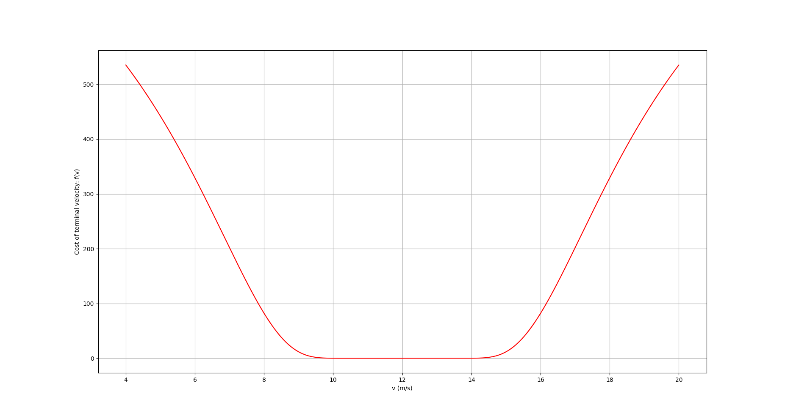

# Black-Box Optimization of Autogyro Blade's Shape

Our team participates in [CanSat Competition 2019](http://www.cansatcompetition.com/) and has to develop a CanSat that
will descent without a parachute, using only freely spining
blades ([autogyro descent](https://en.wikipedia.org/wiki/Autogyro)). We used a simulation (provided to us by NTUA's
Fluid Mechanics Department) that takes as input the blade's
chord and twist at different values of the radius and computes
the angular momentum at the equilibrium point as well as the
terminal velocity of our CanSat.

In order to make our control system's job easier we want to
design a blade that minimizes the angular momentum of the
rotor so as to constrain the gyroscopic effects. To achieve
that we did the following:

### 1. Blade Parametrization

The blade is characterized by 2 functions associating chord
with radius and twist with radius. We modeled the chord-radius
and twist-radius functions as [__Bezier Curves__](https://en.wikipedia.org/wiki/B%C3%A9zier_curve) with 4 and 3
control points respectively. Therefore, we are able to
__uniquely determine a blade using only 7 variables:__

### 2. Cost Function

The angular velocity  and terminal descent rate  computed from
the simulation are a function of our state vector  .

We want the minimum angular velocity and a terminal velocity
in the range [11,14] m/s, so the cost function will look as following:

(Please note that all of the above functions have values in
  the real numbers.)

Where f is a function that has nearly zero values in the
region of interest ( [11,14] ) and grows exponentially outside
this region.For the function f we used:

### 3. Projected Gradient Descent

In order to determine the desired blade, we have to find the state vector  that minimizes our cost function  :

In real life, there are some manufacturing constraints for the blade so the accepted state vectors must lie in a set, let  , that is the set of all blades with certain characteristics.

To minimize the function  over  we will use the Projected
Gradient Descent Algorithm. Starting from a blade with state vector  we are using the following update law to iterratively improve our blade:

Where  is a positive constant.

The partial derivatives are calculated as:

Which can also be written as:

